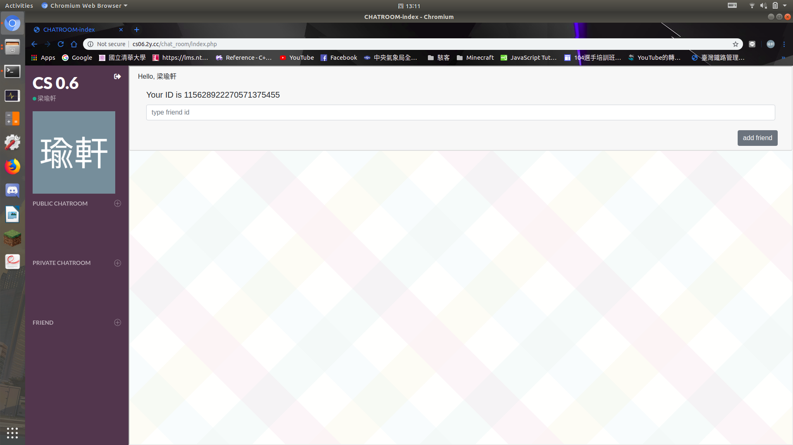
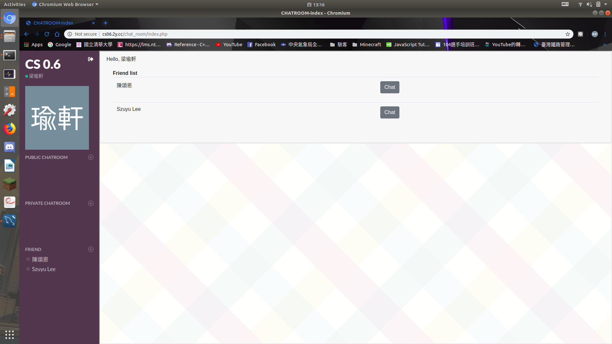
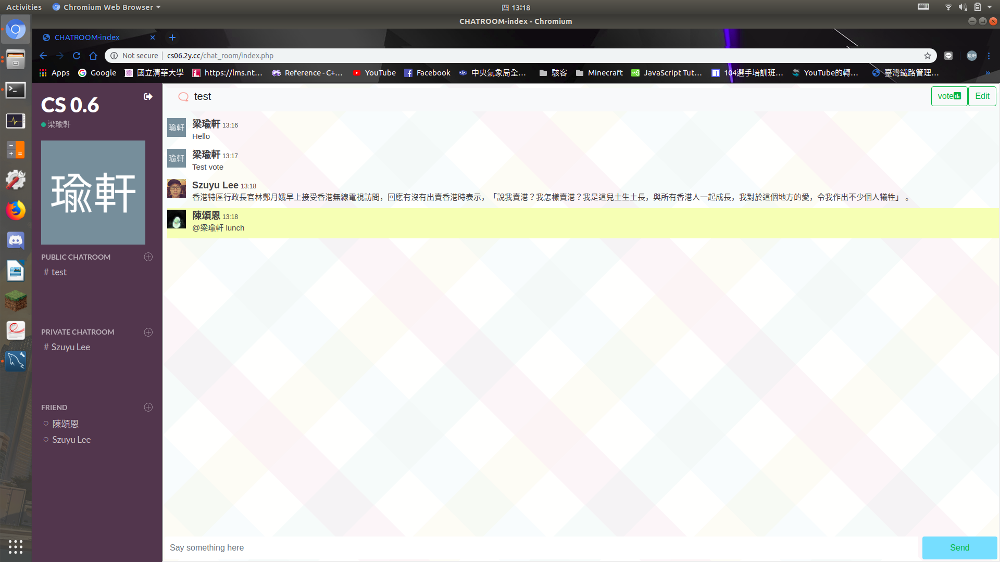
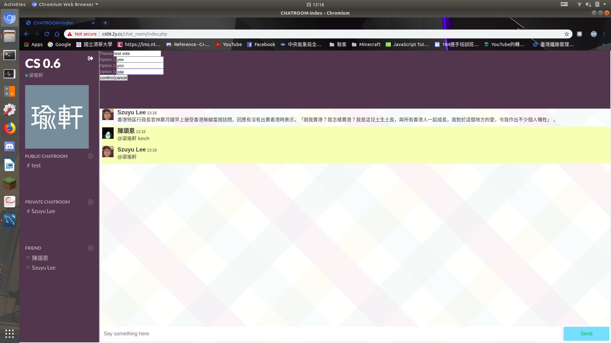
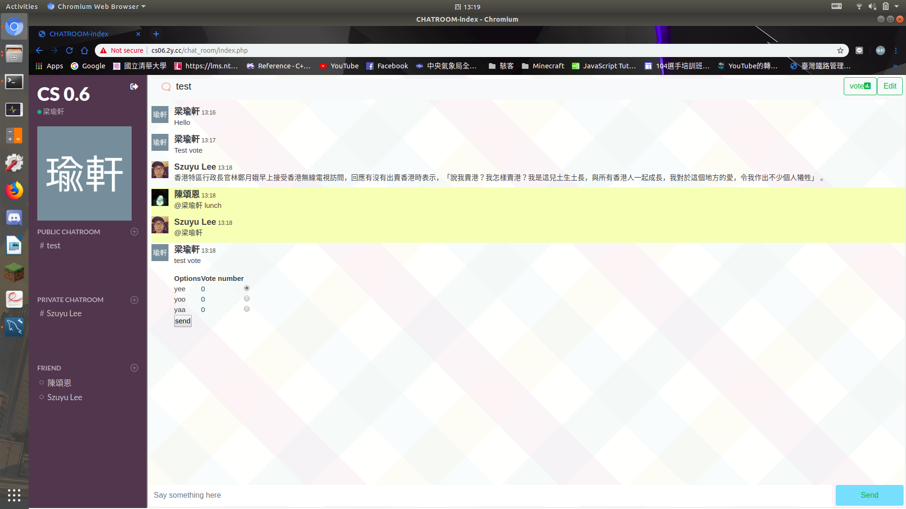
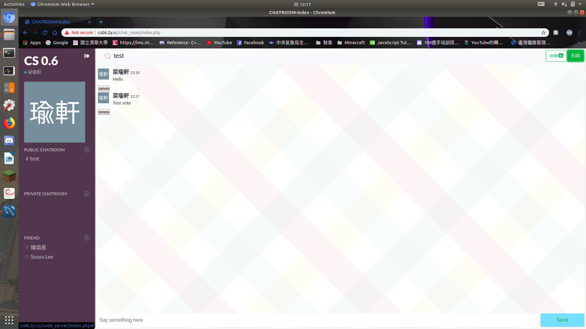
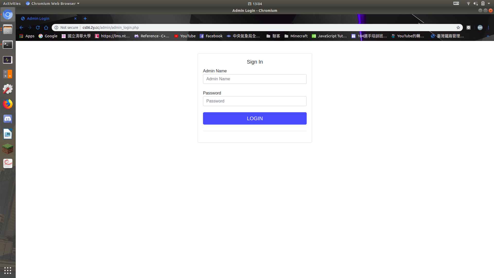
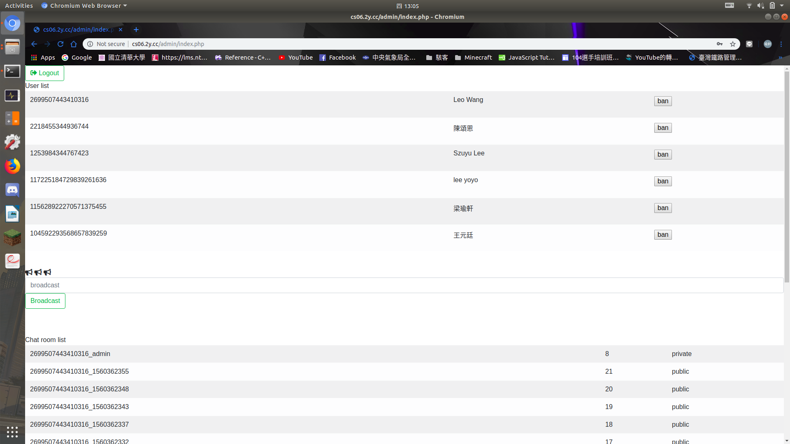

# CS 0.6

*CS 0.6* is a final term project for 2019-Spring *Software Studio* Course in NTHU CS.  
Here is the [SPEC](https://hackmd.io/eKbYWhuwT_qhxavD3OAUPQ?view) from approved proposal.  

## Features
- Based on PHP, MySQL, HTML, Javascript  
- Login with Facebook and Google accounts  
  
- Friends
  1. Friend list in chatroom page
    
  2. Add friend by using id (by using plus icon beside Friend list)
    
- Private and public chatrooms
  1. Add private chatroom and public chatroom by using plus icon beside chatroom list  
   (The new chatroom will show immediately after create successfully)
    
  2. Click chat button beside friend's name to create private chatroom name
    
  3. Type your public chatroom name and join member in create public chatroom name
- Chatroom update immediately when there's a new message
- Tag other by type '@' before friend's name
    
- Voting (Only available for public chatroom)
  1. Create vote by clicking vote button in a public chatroom
  2. Form vote title and option name
  3. Click confirm to create vote
    
  4. Chatroom member can choose option in chatroom (Everyone can only choose once)
    
- Unsend message (Only messages send by you can delete)
  1. Click Edit button in chatroom to show delete message button
  2. Click delete button to delete message
    
- Admin page: banning users, broadcast
  1. Press shift and click facebook button to redirect to admin login page when you're in login page
    
  2. Enter admin information to login with admin permission
    
  3. Ban users by click ban button beside user's name vise versa
  4. Admin can broadcast message to all chatroom (include private and public chatroom) by using broadcast textbox
    

## [Demo](https://cs06.2y.cc)

## Usage

### Preparation
Before deploying this project, you wil need to:  
1. Set up PHP.
2. Set up your own Facebook app and Google project with OAuth credential  
    (reference: [Facebook PHP] and [Google OAuth]).  
    Change CLIENT_ID,ClIENT_SECRET,CLIENT_REDIRECT_URL in google/settings.php  
    Change all 'app_id' 'app_secret' in fb/index.php fb/fb-callback.php
3. Install and set up MySQL.
4. Modified config.php to set Mysql database name, server location, password, admin name, admin password etc.
5. Execute database\_establish\_command.php to initialize Mysql database.
6. Install and set up Node.js.

### Deploy
1. Execute node\_server/index.js by execute command "node index.js" and keep it running

## Contributors

- 106062119 王元廷
- 106062128 陳頌恩
- 106062129 梁瑜軒
- 106062328 李思佑
> Contributions are recorded in [CHANGELOG](CHANGELOG.md)  

## License
MIT License

Copyright (c) 2019 NTHU softwarestudio team6

Permission is hereby granted, free of charge, to any person obtaining a copy
of this software and associated documentation files (the "Software"), to deal
in the Software without restriction, including without limitation the rights
to use, copy, modify, merge, publish, distribute, sublicense, and/or sell
copies of the Software, and to permit persons to whom the Software is
furnished to do so, subject to the following conditions:

The above copyright notice and this permission notice shall be included in all
copies or substantial portions of the Software.

THE SOFTWARE IS PROVIDED "AS IS", WITHOUT WARRANTY OF ANY KIND, EXPRESS OR
IMPLIED, INCLUDING BUT NOT LIMITED TO THE WARRANTIES OF MERCHANTABILITY,
FITNESS FOR A PARTICULAR PURPOSE AND NONINFRINGEMENT. IN NO EVENT SHALL THE
AUTHORS OR COPYRIGHT HOLDERS BE LIABLE FOR ANY CLAIM, DAMAGES OR OTHER
LIABILITY, WHETHER IN AN ACTION OF CONTRACT, TORT OR OTHERWISE, ARISING FROM,
OUT OF OR IN CONNECTION WITH THE SOFTWARE OR THE USE OR OTHER DEALINGS IN THE
SOFTWARE.

[Facebook PHP]: https://developers.facebook.com/docs/reference/php  
[Google OAuth]: https://developers.google.com/api-client-library/php/auth/web-app#protectauthcode
